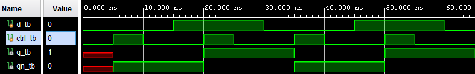

# README Markdown Images

Examples of how to use images in your README Markdown file.


## Insert local images in Markdown

Make sure the file you want to show is __inside__ of your repository.

The formula for inserting images is:
```txt

```
where _name_ is the name you want to give the image for people to see
and _image/location.jpg_ is the image's location in your repository.
The image type does not matter as long as it is an image.

Here are two examples, one in the same folder as the README
and the other in a different folder than README:

Markdown for below:
```txt

```


Markdown for below:
```txt

```


## Insert online images in Markdown

This works the same as [local images](#insert-local-images-in-markdown) with the 
exception that it does not have local. Rather, it is a website.

The formula for inserting these images is:
```txt

```
where _name_ the name you want to give the image for people to see
and _website.com/image.jpg_ is the website the image is on.
The image type does not matter as long as it is an image.

Markdown for below:
```txt

```


## Resources

- A Battery image: https://commons.wikimedia.org/wiki/File:Battery-303889.svg
- Computer image: https://en.wikipedia.org/wiki/UNIVAC_I
